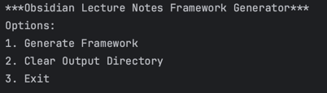

# Program Overview
---
- The purpose of this program is to generate a lecture notes framework to be used in Obsidian
- The key component of this program is the individual lecture slide note markdown file (which is generated by the program).
  - Each lecture slide markdown file will have a link to a corresponding lecture slide PDF
  - NOTE: This program does not provide support for acquiring the individual lecture slide PDF files, will have to procure a lecture slides PDF and find a way to split the PDF into individual PDF files with the proper file naming convention
    - General PDF Naming Convention: <pageNumber>_<courseName>Lecture<lectureNumber>.pdf
    - Example set of slide PDFs (Course Name: EECS 20, Lecture Number: 1, Total Number of Slides: 25): {1_eecs20Lecture1.pdf, 2_eecs20Lecture1.pdf, ..., 25_eecs20Lecture1.pdf}
- The PDF files can be placed anywhere inside the Obsidian vault and the lecture slide note files will be able to reference them
  - SUGGESTION: Place the pdf files w/i a "assets" directory for organization

# How to Use
---
- Run the main loop inside the ObsidianLectureNotesFrameworkGenerator.java file: 
  - 1: Makes you go through a series of prompts that will generate the notes framework for you
  - 2: Clears the markdownOutput directory, to prepare for the next job
  - 3: Exits the program